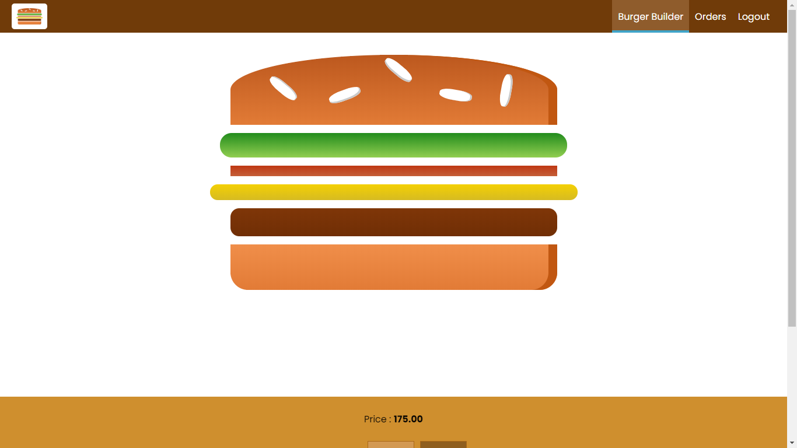
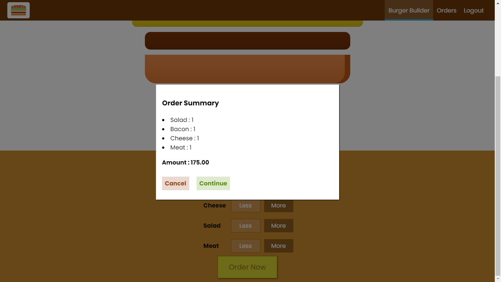
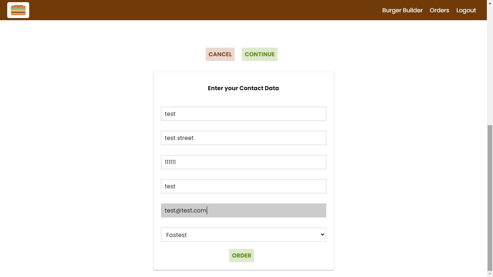
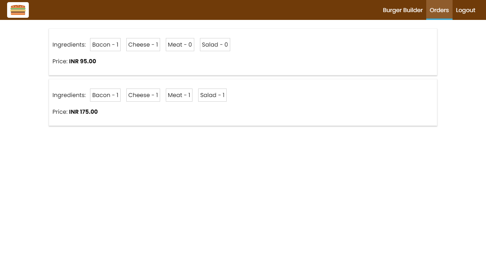

# Burger Builder - React App 
### React Code-along Project, Create and order Burgers [Demo Link](https://react-burger-builder-5c613.web.app/)  

**Get Started**
1. Rename `urls-sample.js` file in `src` directory to `urls.js`  
2. Create a [New Firebase Project](https://console.firebase.google.com/)  
3. Select `Realtime Databse` from `Database` tab.
4. Copy Realtime Database URL and paste in `urls.js` as `FIREBASE_BASE_URL`
5. Copy `Web API Key` from `Project Settings` and paste in `urls.js` as `FIREBASE_WEB_API_KEY`  
*Verify Firebase Sign In/Sign Up URLs [here](https://firebase.google.com/docs/reference/rest/auth#section-create-email-password)*
6. Run `npm start`

---
### Screenshots  
    

   
